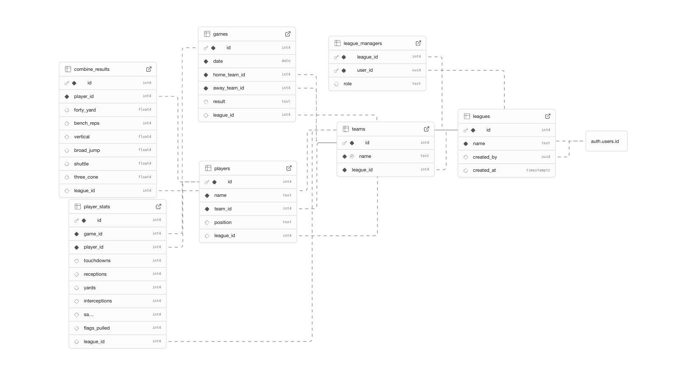

# Project Overview

## Summary
<!-- One to three sentences describing the project -->
  This project is a web app for tracking flag football stats. When users create an account, they can create their own leagues to manage with the ability to add teams, players, record games and player stats.
  League managers can add other users as collaborators so they can also manage the league.
  
---

## Diagrams, Demo Video, or GIFs
<!-- Include architecture diagrams, ER diagrams, screenshots, or demo videos -->

- Diagram(s):
  - 

- Demo Video / GIF:
  - [Link to demo video](./images/flag_football_stats_demo.mp4)
  - 

---

## What I Learned
<!-- Describe the main concepts, tools, or skills you learned during this project -->

---

## AI Integration
### Does your project integrate with AI in any interesting way?
<!-- If yes, describe how AI is integrated into the project -->
<!-- If no, briefly state that AI is not directly integrated -->

---

## Use of AI During Development
<!-- Describe how you used AI tools (e.g., ChatGPT, Copilot) to assist with design, debugging, learning, or implementation -->

---

## Why This Project Is Interesting to Me
<!-- Explain your motivation for choosing this project and why it matters to you -->

---

## Key Learnings
<!-- Try to include at least 3 concrete learnings -->

1. 
2. 
3. 
4. (optional)

---

## System Design & Engineering Considerations
<!-- Explain relevant technical aspects of the system -->

### Architecture
<!-- High-level description of frontend, backend, database, and services -->

### Authentication & Authorization
<!-- How users authenticate and how permissions are enforced (e.g., RLS, roles) -->

### Scaling Characteristics
<!-- How the system scales, potential bottlenecks, and limits -->

### Performance Characteristics
<!-- Query performance, caching, client-side vs server-side work, etc. -->

### Failover & Reliability
<!-- Data durability, backups, failover strategies, or limitations -->

### Concurrency & Data Integrity
<!-- How concurrent updates are handled, conflicts avoided, or transactions managed -->

---

## Future Improvements (Optional)
<!-- Ideas for extending or improving the project -->
