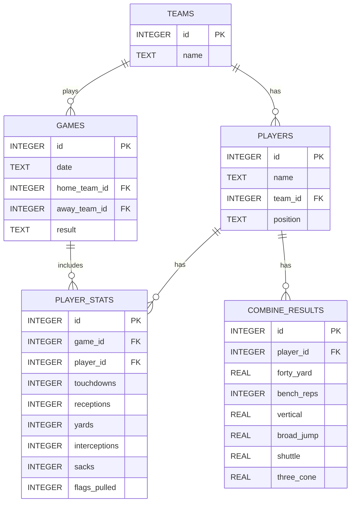
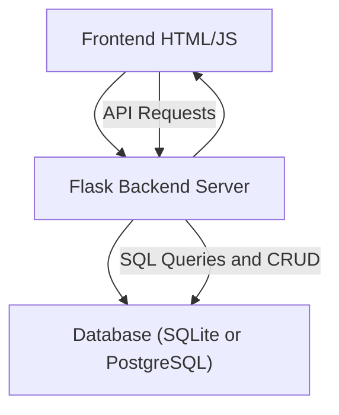

# Flag Football Stats Dashboard

## Project Purpose and Goals

The purpose of this project is to build a **flag football stats-tracking and dashboard application**. Users will be able to record, store, and view stats for teams, players, games, and player combine results. This project demonstrates **database modeling, CRUD operations, REST APIs, and data visualization**.  

Goals:
- Track teams, players, games, player stats, and combine results.
- Display aggregate statistics for players and teams.
- Build a simple HTML/JavaScript frontend dashboard, with potential React integration later.
- Expandable to analytics, leaderboards, and live game tracking.

---

| Day   | Goal                                                                                                                                                  |
| ----- | ----------------------------------------------------------------------------------------------------------------------------------------------------- |
| Day 1 | Set up Flask project structure, install dependencies, create database schema with `teams`, `players`, `games`, `player_stats`, and `combine_results`. |
| Day 2 | Implement CRUD endpoints for teams, players, and games. Test using Postman or curl.                                                                   |
| Day 3 | Add CRUD for player stats and combine results. Verify joins and aggregate queries.                                                                    |
| Day 4 | Build basic HTML/JS dashboard to display teams, players, games, and stats.                                                                            |
| Day 5 | Implement aggregated stats per player/game and simple filters. Clean up UI and test workflow.                                                         |
| Day 6 | Optional: Add leaderboards, analytics, or advanced visualizations.                                                                                    |
| Day 7 | Optional: Deploy locally or on free cloud service. Final testing and documentation.                                                                   |

## Initial Entity-Relationship Diagram (ERD)

